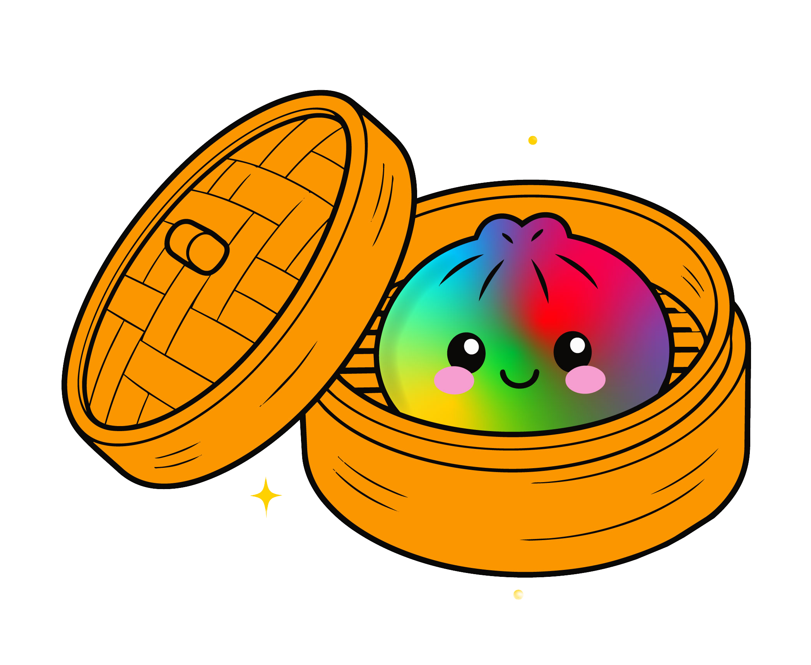

<!DOCTYPE html>
<html lang="pt-BR">
<head>
    <meta charset="UTF-8">
    <meta name="viewport" content="width=device-width, initial-scale=1.0">
    <title>Bloopy - Mystery Dumpling</title>
    <!-- Tailwind CSS para estilização rápida -->
    
    <!-- Google Fonts para tipografia divertida -->
    <link href="https://fonts.googleapis.com/css2?family=Fredoka+One&family=Nunito:wght@400;700&display=swap" rel="stylesheet">
    <!-- FontAwesome para ícones -->
    <link rel="stylesheet" href="https://cdnjs.cloudflare.com/ajax/libs/font-awesome/6.4.0/css/all.min.css">
    
    
    
    
</head>

<body class="font-body text-bloopy-dark antialiased">

    <!-- Navegação -->
    <nav class="fixed w-full z-50 transition-all duration-300 py-2" id="navbar">
        

            

                

                    Bloopy
                

                

                    <a href="#home" class="text-white font-bold text-lg hover:text-bloopy-yellow transition-colors drop-shadow-md">Home</a>
                    <a href="#sobre" class="text-white font-bold text-lg hover:text-bloopy-yellow transition-colors drop-shadow-md">O que é?</a>
                    <a href="#colecione" class="text-white font-bold text-lg hover:text-bloopy-yellow transition-colors drop-shadow-md">Colecione</a>
                    <a href="#viral" class="text-white font-bold text-lg hover:text-bloopy-yellow transition-colors drop-shadow-md">Vídeos Virais</a>
                

                

                    <a href="#comprar" class="bg-bloopy-yellow text-bloopy-dark font-display py-2 px-6 rounded-full hover:bg-white hover:text-bloopy-purple transition-all transform hover:scale-105 shadow-lg border-2 border-white">
                        Comprar Agora!
                    </a>
                

                <!-- Mobile menu button -->
                

                    <button id="mobile-menu-btn" class="text-white hover:text-bloopy-yellow focus:outline-none">
                        <i class="fas fa-bars text-2xl drop-shadow-md"></i>
                    </button>
                

            

        

        <!-- Mobile Menu (hidden by default) -->
        

            

                <a href="#home" class="block px-3 py-2 text-white font-bold hover:bg-bloopy-purple rounded-md">Home</a>
                <a href="#sobre" class="block px-3 py-2 text-white font-bold hover:bg-bloopy-purple rounded-md">O que é?</a>
                <a href="#colecione" class="block px-3 py-2 text-white font-bold hover:bg-bloopy-purple rounded-md">Colecione</a>
                <a href="#viral" class="block px-3 py-2 text-white font-bold hover:bg-bloopy-purple rounded-md">Vídeos Virais</a>
                <a href="#comprar" class="block px-3 py-2 text-bloopy-yellow font-display text-xl hover:bg-bloopy-purple rounded-md">Comprar Agora!</a>
            

        

    </nav>

    <!-- Seção Hero: Fluxo ajustado para não transbordar -->
    <section id="home" class="relative pt-36 pb-48 md:pt-48 md:pb-64 overflow-hidden bg-bloopy-blue">
        <!-- Elementos de fundo decorativos inspirados na caixa -->
        

        

        

        

        <!-- Container principal -->
        

            

                
                <!-- Texto Hero -->
                

                    

                        <i class="fas fa-star text-orange-500 mr-2"></i>Fun Squishy!
                    

                    <h1 class="font-display text-5xl md:text-7xl lg:text-8xl text-white text-shadow-md mb-2 tracking-wide text-outline">
                        MYSTERY
                    </h1>
                    <h1 class="font-display text-4xl md:text-6xl text-bloopy-yellow text-shadow-md mb-6 transform -rotate-3 inline-block">
                        DUMPLING
                    </h1>
                    
                    

                        Qual será a sua cor?? Aperte, estique e descubra o squishy mais divertido do momento!
                    

                    
                    

                        <a href="#comprar" class="bg-white text-bloopy-purple font-display text-xl py-4 px-8 rounded-full shadow-xl hover:scale-105 hover:bg-bloopy-yellow hover:text-bloopy-dark transition-all flex items-center justify-center group border-4 border-bloopy-purple">
                            <i class="fas fa-shopping-cart mr-2 group-hover:animate-bounce"></i> Garantir o Meu
                        </a>
                        <a href="#viral" class="bg-transparent border-4 border-white text-white font-display text-xl py-4 px-8 rounded-full shadow-lg hover:bg-white hover:text-bloopy-blue transition-all flex items-center justify-center">
                            <i class="fas fa-play mr-2"></i> Ver Vídeos
                        </a>
                    

                    
                    

                        +3 ANOS
                        Contém 12 Unidades na caixa
                    

                

                <!-- Imagem/Gráfico Hero -->
                

                    <!-- Simulação do Dumpling Principal (baseado na caixa) -->
                    

                        <!-- Imagem do personagem do repositório (com fundo removido via CSS mix-blend-multiply) -->
                        
                        
                        <!-- Ponto de interrogação flutuante -->
                        

                            ?!
                        

                    

                    
                    <!-- Dumplings menores ao redor -->
                    

                         

                    

                    

                         

                    

                    

                         

                    

                

            

        

        
        <!-- Onda separadora na base com translate para alinhar perfeitamente -->
        

            <svg viewBox="0 0 1200 120" preserveAspectRatio="none" class="w-full h-16 md:h-32 text-white fill-current block">
                <path d="M321.39,56.44c58-10.79,114.16-30.13,172-41.86,82.39-16.72,168.19-17.73,250.45-.39C823.78,31,906.67,72,985.66,92.83c70.05,18.48,146.53,26.09,214.34,3V120H0V95.8C59.71,118.08,130.83,123.63,200.2,112.3Z" opacity=".25"></path>
                <path d="M0,0V46.29c47.79,22.2,103.59,32.15,158,28,70.36-5.37,136.33-33.31,206.8-37.5C438.64,32.43,512.34,53.67,583,72.05c69.27,18,138.3,24.88,209.4,13.08,36.15-6,69.85-17.84,104.45-29.34C989.49,25,1113-14.29,1200,52.47V0Z" opacity=".5"></path>
                <path d="M0,0V15.81C13,36.92,27.64,56.86,47.69,72.05,99.41,111.27,165,111,224.58,91.58c31.15-10.15,60.09-26.07,89.67-39.8,40.92-19,84.73-46,130.83-49.67,36.26-2.85,70.9,9.42,98.6,31.56,31.77,25.39,62.32,62,103.63,73,40.44,10.79,81.35-6.69,119.13-24.28s75.16-39,116.92-43.05c59.73-5.85,113.28,22.88,168.9,38.84,30.2,8.66,59,6.17,87.09-7.5,22.43-10.89,48-26.93,60.65-49.24V0Z"></path>
            </svg>
        

    </section>

    <section id="sobre" class="py-20 bg-white">
        

            

                <h2 class="font-display text-4xl md:text-5xl text-bloopy-purple mb-4">Aperte e Surpreenda-se!</h2>
                

            

            

                <!-- Card 1 -->
                

                    

                        <i class="fas fa-question text-4xl text-bloopy-blue"></i>
                    

                    <h3 class="font-display text-2xl mb-3 text-bloopy-dark">Cores Misteriosas</h3>
                    
Por fora parece um Dumpling fofinho de massa... mas qual será a cor dele por dentro? É uma surpresa!

                

                <!-- Card 2 -->
                

                    

                        <i class="fas fa-hand-rock text-4xl text-bloopy-pink"></i>
                    

                    <h3 class="font-display text-2xl mb-3 text-bloopy-dark">Super Squishy</h3>
                    
Aperte muito! Ele é super macio, estica e volta ao normal. A sensação tátil é incrível e relaxante.

                

                <!-- Card 3 -->
                

                    

                        <i class="fas fa-users text-4xl text-bloopy-orange"></i>
                    

                    <h3 class="font-display text-2xl mb-3 text-bloopy-dark">Colecione Todos</h3>
                    
São várias cores para descobrir! Troque com os amigos e tente achar o raro dumpling dourado!

                

            

            
            <!-- Imagens explicativas baseadas na caixa (Aperte) -->
            

                

                    <h3 class="font-display text-3xl text-bloopy-green mb-4">Como funciona?</h3>
                    
A magia acontece quando você aperta! A capa externa macia revela a verdadeira cor do seu Dumpling.

                    <ul class="space-y-3 font-bold text-gray-600">
                        <li class="flex items-center"><i class="fas fa-check-circle text-bloopy-green mr-2"></i> 1. Abra a caixinha surpresa</li>
                        <li class="flex items-center"><i class="fas fa-check-circle text-bloopy-green mr-2"></i> 2. Pegue seu Dumpling macio</li>
                        <li class="flex items-center"><i class="fas fa-check-circle text-bloopy-green mr-2"></i> 3. <strong>APERTE COM VONTADE!</strong></li>
                        <li class="flex items-center"><i class="fas fa-check-circle text-bloopy-green mr-2"></i> 4. Descubra a cor que vai estourar!</li>
                    </ul>
                

                
                <!-- Simulação dos ícones "Aperte" da caixa -->
                

                    

                        

                            <i class="far fa-smile text-3xl text-pink-300 mb-1"></i>
                            
Antes

                        

                    

                    <i class="fas fa-arrow-right text-3xl text-bloopy-blue self-center animate-pulse"></i>
                    

                        <!-- Simulação do aperto -->
                        

                        

                        

                        
Apertado!

                    

                

            

        

    </section>

    <section id="viral" class="py-20 bg-gradient-to-b from-bloopy-purple to-bloopy-blue overflow-hidden relative">
        <!-- Background elements -->
        

            <i class="fas fa-heart text-white text-6xl absolute top-10 left-10 transform -rotate-12"></i>
            <i class="fas fa-share text-white text-4xl absolute bottom-20 left-1/4 transform rotate-12"></i>
            <i class="fas fa-play text-white text-8xl absolute top-1/4 right-10 transform rotate-45"></i>
            <i class="fas fa-fire text-white text-5xl absolute bottom-10 right-1/3"></i>
        

        

            

                

                    <i class="fab fa-tiktok mr-2 text-[#ff0050]"></i> #MysteryDumpling
                

                <h2 class="font-display text-4xl md:text-6xl text-white text-shadow-md mb-4 text-outline">Febre na Internet!</h2>
                
Veja as reações de quem apertou pela primeira vez!

            

            <!-- Container do Carrossel -->
            

                <!-- Botões de navegação (Visíveis em telas maiores) -->
                <button id="prevBtn" class="hidden md:flex absolute left-[-20px] top-1/2 transform -translate-y-1/2 w-12 h-12 bg-white rounded-full items-center justify-center shadow-xl text-bloopy-dark z-20 hover:bg-bloopy-yellow transition-colors border-2 border-gray-200">
                    <i class="fas fa-chevron-left text-xl"></i>
                </button>
                <button id="nextBtn" class="hidden md:flex absolute right-[-20px] top-1/2 transform -translate-y-1/2 w-12 h-12 bg-white rounded-full items-center justify-center shadow-xl text-bloopy-dark z-20 hover:bg-bloopy-yellow transition-colors border-2 border-gray-200">
                    <i class="fas fa-chevron-right text-xl"></i>
                </button>

                <!-- Track do Carrossel (Scroll horizontal) -->
                

                    
                    <!-- Vídeo Fake 1 -->
                    

                        <!-- Imagem placeholder representando o thumbnail do video -->
                        
                        <!-- Overlay da interface de short video -->
                        

                        <!-- Play Button (Aparece no hover) -->
                        

                            <i class="fas fa-play-circle text-6xl text-white opacity-80"></i>
                        

                        <!-- UI Elements -->
                        

                            
@bloopyfan_oficial

                            
Qual cor vcs acham que é? 😱 #bloopy #mysterydumpling

                        

                        <!-- Lateral Actions -->
                        

                            

                                

                                    <i class="fas fa-heart text-white text-xl"></i>
                                

                                124K
                            

                            

                                

                                    <i class="fas fa-comment-dots text-white text-xl"></i>
                                

                                1.2K
                            

                            

                                

                                    <i class="fas fa-share text-white text-xl"></i>
                                

                                5K
                            

                        

                    

                    <!-- Vídeo Fake 2 -->
                    

                        
                        

                        

                            <i class="fas fa-play-circle text-6xl text-white opacity-80"></i>
                        

                        

                            
@toyreviewer

                            
Melhor fidget toy de 2024! 😍 Satisfatório demais. #fidget #asmr

                        

                        

                            

                                

                                    <i class="fas fa-heart text-red-500 text-xl"></i>
                                

                                342K
                            

                            

                                

                                    <i class="fas fa-comment-dots text-white text-xl"></i>
                                

                                4.5K
                            

                            

                                

                                    <i class="fas fa-share text-white text-xl"></i>
                                

                            

                        

                    

                    <!-- Vídeo Fake 3 -->
                    

                        
                        

                        

                            <i class="fas fa-play-circle text-6xl text-white opacity-80"></i>
                        

                        

                            
@relaxing_times

                            
Achei o ROXO MÍSTICO!! 🔮🔮🔮 #bloopy #raro

                        

                        

                            

                                

                                    <i class="fas fa-heart text-white text-xl"></i>
                                

                                89K
                            

                            

                                

                                    <i class="fas fa-comment-dots text-white text-xl"></i>
                                

                            

                            

                                

                                    <i class="fas fa-share text-white text-xl"></i>
                                

                            

                        

                    

                    <!-- Vídeo Fake 4 -->
                    

                        
                        

                        

                            <i class="fas fa-play-circle text-6xl text-white opacity-80"></i>
                        

                        

                            
@kids_fun_br

                            
Comprei a caixa inteira! Vamos abrir todos! 🎁 #unboxing

                        

                        

                            

                                

                                    <i class="fas fa-heart text-white text-xl"></i>
                                

                                512K
                            

                            

                                

                                    <i class="fas fa-comment-dots text-white text-xl"></i>
                                

                            

                        

                    

                     <!-- Vídeo Fake 5 -->
                     

                        
                        

                        

                            <i class="fas fa-play-circle text-6xl text-white opacity-80"></i>
                        

                        

                            
@brincadeiras_legais

                            
Olha como estica! Verde alienígena! 👽💚

                        

                        

                            

                                

                                    <i class="fas fa-heart text-white text-xl"></i>
                                

                                67K
                            

                        

                    

                

            

            
            

                
Arraste para o lado para ver mais <i class="fas fa-arrows-alt-h mx-2"></i>

                <a href="#" class="inline-block border-2 border-white text-white font-display px-6 py-2 rounded-full hover:bg-white hover:text-bloopy-blue transition-colors">
                    Siga a gente no TikTok @bloopy_br
                </a>
            

        

    </section>

    <section id="colecione" class="py-20 bg-[#e0f7fa]">
        

            

                
                <h2 class="font-display text-4xl md:text-5xl text-bloopy-dark mb-2">Colecione Todos!</h2>
                
Encontre o Dumpling Escondido!

            

            <!-- Grid de Cores Baseado na arte da caixa -->
            

                
                <!-- Enfeite de background -->
                

                <!-- Cor 1 (Amarelo) -->
                

                    

                        

                    

                    
Raio de Sol

                

                <!-- Cor 2 (Rosa/Vermelho) -->
                

                    

                        

                    

                    
Morango

                

                <!-- Cor 3 (Azul claro) -->
                

                    

                        

                    

                    
Céu Azul

                

                <!-- Cor 4 (Roxo) -->
                

                    

                        

                    

                    
Uva Doce

                

                <!-- Cor 5 (Multicolor/Raro) -->
                

                    
✨

                    

                        

                    

                    
Galáxia (RARO!)

                

                <!-- Cor 6 (Verde) -->
                

                    

                        

                    

                    
Maçã Verde

                

            

            

                

                    

                        <i class="fas fa-box-open text-3xl text-bloopy-blue"></i>
                    

                    

                        <h4 class="font-display text-2xl text-bloopy-dark">A Caixa Display</h4>
                        
Contém 12 unidades sortidas.

                    

                

                <a href="#comprar" class="bg-bloopy-green text-white font-display text-xl py-3 px-8 rounded-full shadow-lg hover:scale-105 hover:bg-green-500 transition-all text-center">
                    Comprar Caixa Fechada
                </a>
            

        

    </section>

    <!-- Seção de Compra / Call to Action Final -->
    <section id="comprar" class="py-24 bg-bloopy-yellow relative overflow-hidden">
        <!-- SVG Wave Top -->
        

            <svg viewBox="0 0 1200 120" preserveAspectRatio="none" class="w-full h-12 text-[#e0f7fa] fill-current">
                <path d="M321.39,56.44c58-10.79,114.16-30.13,172-41.86,82.39-16.72,168.19-17.73,250.45-.39C823.78,31,906.67,72,985.66,92.83c70.05,18.48,146.53,26.09,214.34,3V120H0V95.8C59.71,118.08,130.83,123.63,200.2,112.3Z"></path>
            </svg>
        

        

            <h2 class="font-display text-5xl md:text-6xl text-bloopy-dark mb-6 text-shadow-sm">Qual será a sua cor?</h2>
            
Não fique de fora dessa febre. Garanta o seu Mystery Dumpling hoje mesmo!

            
            

                <button onclick="showMessage('Adicionado ao carrinho!')" class="bg-bloopy-purple text-white font-display text-2xl py-4 px-10 rounded-full shadow-xl hover:scale-105 transition-transform border-4 border-white flex items-center justify-center">
                    <i class="fas fa-shopping-bag mr-3"></i> Comprar 1 Unidade
                </button>
                <button onclick="showMessage('Caixa (12 un) adicionada ao carrinho!')" class="bg-white text-bloopy-dark font-display text-2xl py-4 px-10 rounded-full shadow-xl hover:scale-105 transition-transform border-4 border-bloopy-purple flex items-center justify-center">
                    <i class="fas fa-box mr-3"></i> Levar a Caixa (12 un)
                </button>
            

            
*Indicado para crianças maiores de 3 anos (+3)

        

    </section>

    <!-- Footer -->
    <footer class="bg-bloopy-dark text-white py-10">
        

            

                <h3 class="font-display text-3xl mb-4 text-bloopy-yellow">Bloopy</h3>
                
Fun Squishy. Fabricando sorrisos e diversão misteriosa.

                

                    <a href="#" class="w-10 h-10 rounded-full bg-gray-700 flex items-center justify-center hover:bg-bloopy-yellow hover:text-bloopy-dark transition-colors"><i class="fab fa-instagram"></i></a>
                    <a href="#" class="w-10 h-10 rounded-full bg-gray-700 flex items-center justify-center hover:bg-bloopy-yellow hover:text-bloopy-dark transition-colors"><i class="fab fa-tiktok"></i></a>
                    <a href="#" class="w-10 h-10 rounded-full bg-gray-700 flex items-center justify-center hover:bg-bloopy-yellow hover:text-bloopy-dark transition-colors"><i class="fab fa-youtube"></i></a>
                

            

            

                <h4 class="font-bold text-xl mb-4 text-white">Links Rápidos</h4>
                <ul class="space-y-2 text-gray-400 font-bold">
                    <li><a href="#home" class="hover:text-bloopy-yellow">Home</a></li>
                    <li><a href="#sobre" class="hover:text-bloopy-yellow">Como Funciona</a></li>
                    <li><a href="#colecione" class="hover:text-bloopy-yellow">Coleção</a></li>
                    <li><a href="#" class="hover:text-bloopy-yellow">Atendimento ao Cliente</a></li>
                </ul>
            

            

                <h4 class="font-bold text-xl mb-4 text-white">Segurança</h4>
                

                    

                        0-3
                    

                    

                        ATENÇÃO! Não recomendável para crianças menores de 3 anos por conter partes pequenas que podem ser engolidas.
                    

                

            

        

        

            &copy; 2024 Bloopy Fun Squishy. Todos os direitos reservados.
        

    </footer>

    <!-- Caixa de Mensagem Customizada (Substitui alert) -->
    

        <i class="fas fa-check-circle text-bloopy-green text-2xl mr-3"></i>
        

    

    <!-- Scripts -->
    
</body>
</html>
