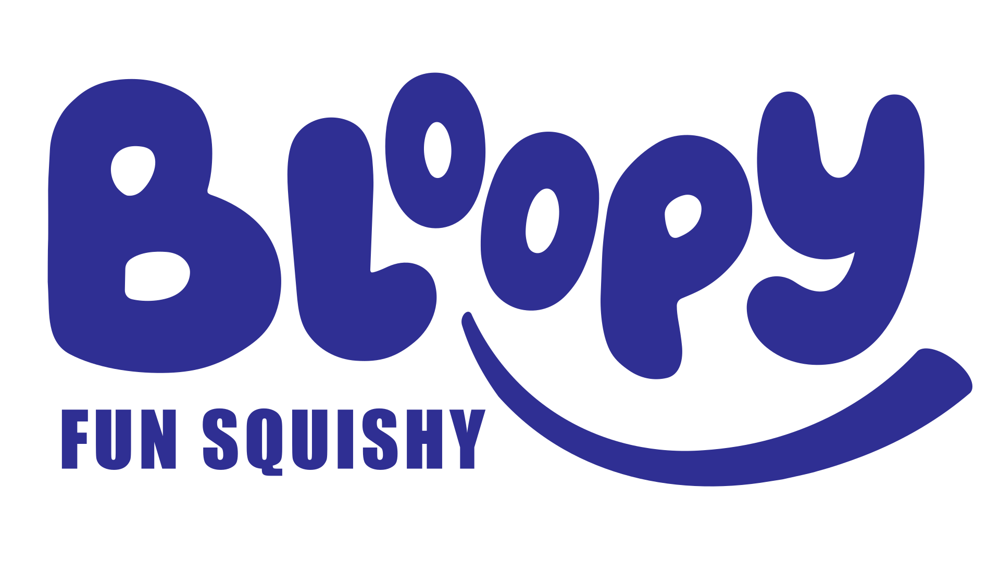
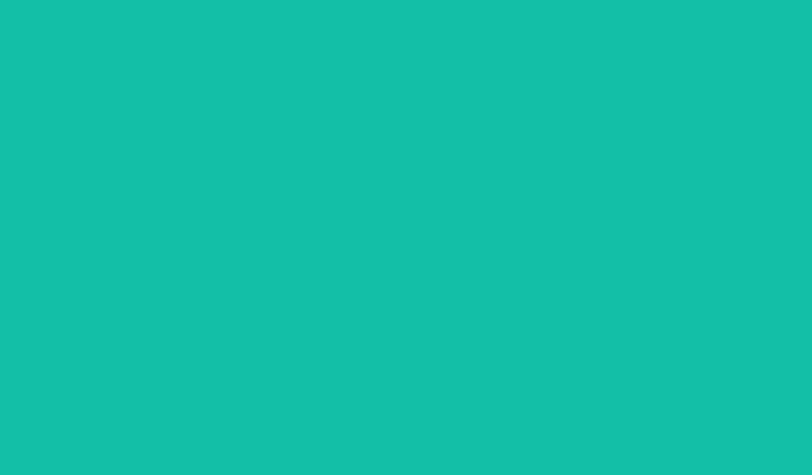

import React from 'react';
import { Instagram, Youtube, Music2, Menu } from 'lucide-react';

const DumplingSVG = ({ color1, color2, scale = 1, isMain = false }) => (
  <svg 
    viewBox="0 0 100 100" 
    className={`w-full h-full ${isMain ? 'drop-shadow-[0_0_40px_rgba(255,255,255,0.7)] animate-bounce-slow' : 'drop-shadow-lg'}`}
    style={{ transform: `scale(${scale})` }}
  >
    <defs>
      <linearGradient id={`grad-${color1}`} x1="0%" y1="0%" x2="100%" y2="100%">
        <stop offset="0%" stopColor={color1} />
        <stop offset="100%" stopColor={color2} />
      </linearGradient>
      {isMain && (
        <radialGradient id="sparkle" cx="50%" cy="30%" r="50%">
          <stop offset="0%" stopColor="#ffffff" stopOpacity="0.8" />
          <stop offset="100%" stopColor="transparent" stopOpacity="0" />
        </radialGradient>
      )}
    </defs>

    {/* Corpo do Dumpling */}
    <path 
      d="M 15 75 C 15 35, 30 15, 50 15 C 70 15, 85 35, 85 75 C 85 95, 70 98, 50 98 C 30 98, 15 95, 15 75 Z" 
      fill={`url(#grad-${color1})`} 
    />
    
    {isMain && (
       <path 
        d="M 15 75 C 15 35, 30 15, 50 15 C 70 15, 85 35, 85 75 C 85 95, 70 98, 50 98 C 30 98, 15 95, 15 75 Z" 
        fill="url(#sparkle)" 
      />
    )}

    {/* Dobrinhas (Folds) no topo */}
    <path d="M 40 18 Q 50 10 60 18" stroke="rgba(255,255,255,0.4)" strokeWidth="3" fill="none" strokeLinecap="round" />
    <path d="M 30 25 Q 50 15 70 25" stroke="rgba(255,255,255,0.3)" strokeWidth="2" fill="none" strokeLinecap="round" />

    {/* Rosto Kawaii */}
    <circle cx="38" cy="60" r="4" fill="#1a1a1a" />
    <circle cx="62" cy="60" r="4" fill="#1a1a1a" />
    
    {/* Brilho nos olhos */}
    <circle cx="37" cy="58" r="1.5" fill="#ffffff" />
    <circle cx="61" cy="58" r="1.5" fill="#ffffff" />

    {/* Sorriso */}
    <path d="M 46 65 Q 50 72 54 65" stroke="#1a1a1a" strokeWidth="3" fill="none" strokeLinecap="round" />
    
    {/* Bochechas */}
    <ellipse cx="28" cy="65" rx="5" ry="3" fill="#ff99cc" opacity="0.6" />
    <ellipse cx="72" cy="65" rx="5" ry="3" fill="#ff99cc" opacity="0.6" />
  </svg>
);

const SteamerSVG = () => (
  <svg viewBox="0 0 200 100" className="w-full h-full drop-shadow-xl z-20 relative mt-[-20px]">
    {/* Borda superior traseira */}
    <ellipse cx="100" cy="30" rx="80" ry="15" fill="#e6c28c" />
    {/* Interior escuro */}
    <ellipse cx="100" cy="30" rx="72" ry="12" fill="#c49b5e" />
    
    {/* Corpo do cesto */}
    <path d="M 20 30 L 25 75 Q 100 95 175 75 L 180 30 Z" fill="#ebd2a9" />
    
    {/* Linhas de textura do bambu */}
    <path d="M 40 35 L 45 78 M 60 38 L 65 83 M 80 40 L 82 86 M 100 41 L 100 88 M 120 40 L 118 86 M 140 38 L 135 83 M 160 35 L 155 78" stroke="#d4b07a" strokeWidth="2" fill="none" />
    
    {/* Borda inferior */}
    <path d="M 25 75 Q 100 95 175 75 L 173 85 Q 100 105 27 85 Z" fill="#d4b07a" />
    
    {/* Logo RMS na cesta */}
    <text x="100" y="65" fontSize="24" fontWeight="900" textAnchor="middle" fill="#ff3366" className="drop-shadow-sm">
      RMS
    </text>
    <text x="100" y="65" fontSize="24" fontWeight="900" textAnchor="middle" fill="none" stroke="#1a1a1a" strokeWidth="1">
      RMS
    </text>
  </svg>
);

export default function App() {
  return (
    

      
      {/* Container Principal do Banner */}
      

        
        {/* Estilos para animações exclusivas */}
        <style dangerouslySetInnerHTML={{__html: `
          @keyframes spin-slow {
            100% { transform: rotate(360deg); }
          }
          @keyframes bounce-slow {
            0%, 100% { transform: translateY(0); }
            50% { transform: translateY(-15px); }
          }
          .animate-spin-slow {
            animation: spin-slow 40s linear infinite;
          }
          .animate-bounce-slow {
            animation: bounce-slow 4s ease-in-out infinite;
          }
          .sunburst {
            background: repeating-conic-gradient(
              from 0deg,
              transparent 0deg,
              transparent 10deg,
              rgba(255, 255, 255, 0.15) 10deg,
              rgba(255, 255, 255, 0.15) 20deg
            );
          }
        `}} />

        {/* Efeito de Raios de Sol ao Fundo (Sunburst) */}
        

        

        {/* Header / Navegação */}
        <header className="relative z-30 flex items-center justify-between bg-[#1f0a59] mx-4 mt-4 px-6 py-4 rounded-xl shadow-lg">
          {/* Logo Marca */}
          

            
             {
                e.target.style.display = 'none';
                e.target.nextElementSibling.style.display = 'flex';
              }}
            />
            {/* Placeholder caso o SVG ainda não exista */}
            

               logo.svg
            

            

              
Super Tendência.

              
Absurdamente Viral.

            

          

          {/* Links e Sociais */}
          

            <nav className="hidden md:flex space-x-6 text-sm font-bold tracking-wide">
              <a href="#" className="text-white hover:text-pink-400 transition-colors border-b-2 border-pink-500 pb-1">INÍCIO</a>
              <a href="#" className="text-gray-300 hover:text-white transition-colors">OS DUMPLINGS</a>
              <a href="#" className="text-gray-300 hover:text-white transition-colors">NOVIDADES</a>
            </nav>
            

              <a href="#" className="hover:text-white hover:scale-110 transition-all"><Music2 size={20} /></a>
              <a href="#" className="hover:text-white hover:scale-110 transition-all"><Instagram size={20} /></a>
              <a href="#" className="hover:text-white hover:scale-110 transition-all"><Youtube size={20} /></a>
            

            <button className="md:hidden text-white">
              <Menu size={24} />
            </button>
          

        </header>

        {/* Conteúdo Principal (Espaço do Banner Completo) */}
        <main className="relative z-20 flex-1 flex flex-col items-center justify-center p-6 md:p-12 w-full min-h-[600px]">
          
          {/* Tag da Imagem puxando o arquivo do repositório */}
           {
              // Fallback visual para mostrar o espaço vazio
              e.target.style.display = 'none';
              e.target.nextElementSibling.style.display = 'flex';
            }}
          />
          
          {/* Placeholder Visual (Aparece apenas se a imagem falhar ao carregar/não for encontrada) */}
          

            <svg className="w-20 h-20 mb-6 opacity-60" fill="none" stroke="currentColor" viewBox="0 0 24 24">
              <path strokeLinecap="round" strokeLinejoin="round" strokeWidth="1.5" d="M4 16v1a3 3 0 003 3h10a3 3 0 003-3v-1m-4-8l-4-4m0 0L8 8m4-4v12"></path>
            </svg>
            <h2 className="font-black text-3xl md:text-4xl mb-4 tracking-tight drop-shadow-md">Área do Banner</h2>
            

              Sua arte do Photoshop vai entrar aqui! Salve a imagem final no Github/repositório e nomeie o arquivo como:
            

            

              banner01.png
            

          

        </main>

      

    

  );
}
